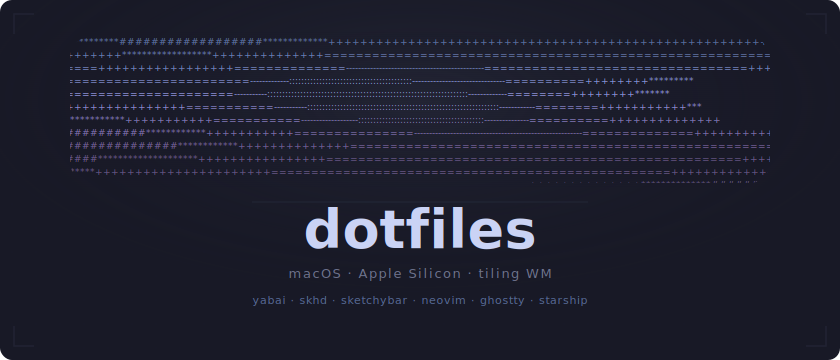
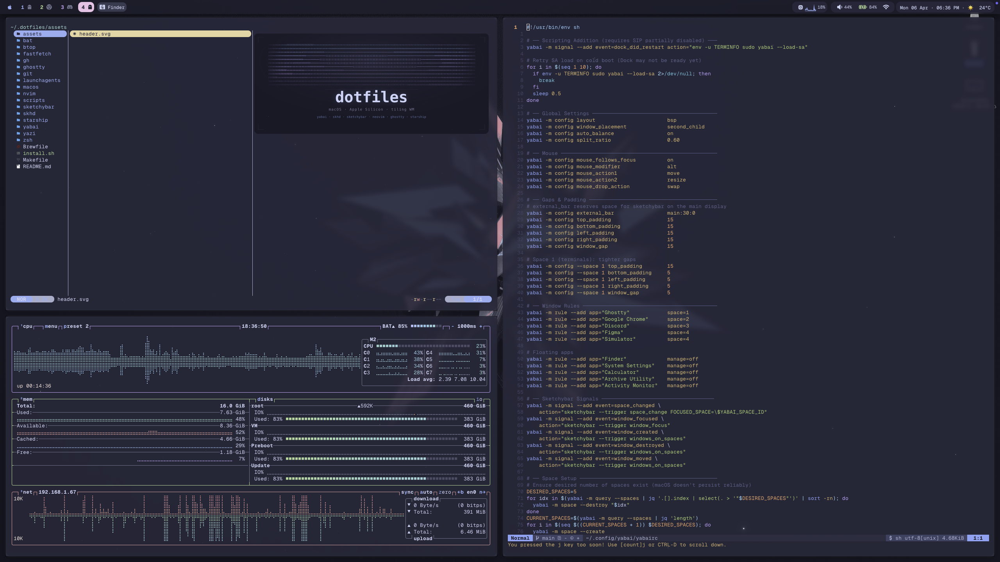

<div align="center">



<br>

[](#requirements)
[](#window-management)
[](#shell--terminal)
[](#catppuccin-macchiato)
[](#yabai--sip)

</div>

<br>

<p align="center">
  
</p>

---

## Quick Start

```bash
bash <(curl -fsSL https://raw.githubusercontent.com/BrunoJurkovic/dotfiles/main/install.sh)
```

<details>
<summary>Manual install</summary>

```bash
git clone https://github.com/BrunoJurkovic/dotfiles.git ~/.dotfiles
cd ~/.dotfiles
make install
```

</details>

<details>
<summary>What <code>install.sh</code> does</summary>

1. Installs Xcode Command Line Tools
2. Installs [Homebrew](https://brew.sh/) (if missing)
3. Clones dotfiles to `~/.dotfiles`
4. Runs `brew bundle` from the Brewfile
5. Symlinks all configs via [GNU Stow](https://www.gnu.org/software/stow/) (zinit + plugins auto-install on first shell)
7. Installs LaunchAgents (yabai, skhd, sketchybar, borders, instantspaces)
8. Optionally applies macOS defaults (`macos/defaults.sh`)

</details>

---

## Window Management

The core of this setup is a **BSP tiling window manager** that assigns apps to labeled spaces, manages multi-display layouts, and keeps everything accessible through vim-style keybindings.

| Service | What it does | Config |
|---------|-------------|--------|
| [yabai](https://github.com/koekeishiya/yabai) | BSP tiling WM with scripting addition | [`yabai/`](yabai/) |
| [skhd](https://github.com/koekeishiya/skhd) | Hotkey daemon &mdash; all alt-based | [`skhd/`](skhd/) |
| [SketchyBar](https://github.com/FelixKratz/SketchyBar) | Status bar with per-space accent colors | [`sketchybar/`](sketchybar/) |
| [JankyBorders](https://github.com/FelixKratz/JankyBorders) | Glow borders &mdash; color matches active space | [`launchagents/`](launchagents/) |
| [instantspaces](https://github.com/flawnn/instantspaces) | Eliminates space-switching animation | [`launchagents/`](launchagents/) |

All five run as LaunchAgents and start automatically on login.

### yabai & SIP

yabai requires **partial SIP disable** to load its scripting addition, which enables window moving across spaces, focus follows mouse, and space management.

The config handles cold boot with a retry loop (up to 10 attempts to load `yabai --load-sa`) and auto-restarts the SA when Dock restarts.

**Layout:**

- Mode: **BSP** with auto-balance, 60/40 split ratio
- Laptop (single display): 10px padding/gaps
- Docked (multi-display): 15px padding/gaps
- Space 1 override: tighter gaps (5px) for terminals

**Window rules:**

| App | Space | Behavior |
|-----|-------|----------|
| Ghostty | 1 &mdash; Terminal | Managed |
| Chrome | 2 &mdash; Browser | Managed |
| Discord | 3 &mdash; Social | Managed |
| Figma | 4 &mdash; Design | Managed |
| Simulator | 4 &mdash; Design | Managed |
| Finder, System Settings, Calculator, Archive Utility, Activity Monitor, About This Mac, Software Update, Keychain Access, Font Book, Disk Utility, Preview, Bitwarden | &mdash; | Floating |
| Picture-in-Picture | &mdash; | Floating, sticky, above |

On launch, yabai ensures exactly **5 spaces** exist (creating or destroying as needed), labels them, and auto-launches Ghostty, Chrome, and Discord if they aren't running.

**Display setup** adapts automatically when monitors are connected/disconnected or on wake from sleep.

### SketchyBar

36px bar at the top of the main display with blur and shadow.

```
[ ] 1  2  3  4  5  | Focused App          Now Playing          CPU ▏ Vol ▏ Bat ▏ WiFi ▏ Apr 6  17:30
```

Per-space accent colors:

| Space | Label | Accent |
|-------|-------|--------|
| 1 | Terminal |  Blue |
| 2 | Browser |  Green |
| 3 | Social |  Mauve |
| 4 | Design |  Pink |
| 5 | Misc |  Teal |

Fonts: **SF Pro** (icons) + **GeistMono Nerd Font** (labels).

### Key Bindings

All window management keybindings use `alt` as the modifier.

<details>
<summary><strong>Window focus & swap</strong></summary>

| Key | Action |
|-----|--------|
| `alt + h/j/k/l` | Focus window (vim directions) |
| `alt + shift + h/j/k/l` | Swap window |
| `alt + n` / `alt + p` | Cycle next / previous window in space |

</details>

<details>
<summary><strong>Spaces & displays</strong></summary>

| Key | Action |
|-----|--------|
| `alt + 1-5` | Focus space |
| `alt + shift + 1-5` | Move window to space (and follow) |
| `alt + tab` | Toggle recent space |
| `alt + shift + tab` | Move window to next display |
| `alt + shift + x` | Mirror tree (x-axis) |
| `alt + shift + y` | Mirror tree (y-axis) |

</details>

<details>
<summary><strong>Layout & resize</strong></summary>

| Key | Action |
|-----|--------|
| `alt + -` / `alt + =` | Shrink / grow window by 5% |
| `alt + /` | Toggle split direction |
| `alt + ,` | Stack layout |
| `alt + .` | BSP layout |

</details>

<details>
<summary><strong>Service mode</strong> &mdash; <code>alt + shift + ;</code> to enter</summary>

| Key | Action |
|-----|--------|
| `r` | Balance / reset layout |
| `f` | Toggle float (centered) |
| `c` | Center floating window |
| `backspace` | Close all windows except current |
| `alt + shift + h/j/k/l` | Warp window (reparent in BSP tree) |
| `up` / `down` | Volume up / down |
| `shift + down` | Mute |

</details>

<details>
<summary><strong>App launchers</strong></summary>

| Key | App |
|-----|-----|
| `alt + t` | Ghostty |
| `alt + y` | Yazi (in Ghostty) |
| `alt + c` | Chrome |
| `alt + d` | Discord |
| `alt + f` | Figma |
| `alt + s` | Simulator |
| `alt + o` | Obsidian |

</details>

---

## Shell & Terminal

| Tool | Config | Role |
|------|--------|------|
| [zsh](https://www.zsh.org/) + [zinit](https://github.com/zdharma-continuum/zinit) | [`zsh/`](zsh/) | Shell with turbo-loaded plugins |
| [Starship](https://starship.rs/) | [`starship/`](starship/) | Two-line prompt with Catppuccin palette |
| [Ghostty](https://ghostty.org/) | [`ghostty/`](ghostty/) | GPU-accelerated terminal |

**Ghostty** runs frameless at 95% opacity with background blur, GeistMono Nerd Font (14px), block cursor, and single-instance mode.

**Starship** renders a two-line prompt:

```
 ~/Dev/project  main +2 !1                           3.2s  17:30
 ❯
```

Directory (blue Powerline), git branch/status, command duration, and time on line 1. Status character on line 2.

**Zsh plugins:** `git`, `zsh-autosuggestions`, `fast-syntax-highlighting`, `zsh-completions`

**Shell aliases:**

| Alias | Expands to |
|-------|-----------|
| `ls` | `eza --icons --group-directories-first` |
| `ll` | `eza -la` |
| `lt` | `eza --tree --level=2` |
| `cat` | `bat --style=plain` |

**Tool integrations** (all guarded with `command -v` checks): Starship, fzf, zoxide, [mise](https://mise.jdx.dev/) (manages Node, Bun, Python).

`fastfetch` runs on every new terminal with a custom ASCII logo in a 5-color blue-to-mauve gradient.

---

## CLI Replacements

Every default replaced with a modern alternative, all installed via the Brewfile.

| Modern | Replaces | Why |
|--------|----------|-----|
| [`bat`](https://github.com/sharkdp/bat) | `cat` | Syntax highlighting, line numbers |
| [`eza`](https://github.com/eza-community/eza) | `ls` | Icons, tree view, git-aware |
| [`ripgrep`](https://github.com/BurntSushi/ripgrep) | `grep` | 10x faster, respects `.gitignore` |
| [`fd`](https://github.com/sharkdp/fd) | `find` | Simpler syntax, faster |
| [`zoxide`](https://github.com/ajeetdsouza/zoxide) | `cd` | Frecency-based directory jumps |
| [`fzf`](https://github.com/junegunn/fzf) | `ctrl-r` | Fuzzy finder for everything |
| [`delta`](https://github.com/dandavison/delta) | `diff` | Side-by-side diffs, syntax highlighting |
| [`yazi`](https://github.com/sxyazi/yazi) | `ranger` | Async file manager with image preview |
| [`btop`](https://github.com/aristocratos/btop) | `htop` | GPU-aware system monitor |
| [`lazygit`](https://github.com/jesseduffield/lazygit) | `git` TUI | Stage, commit, rebase interactively |
| [`tailspin`](https://github.com/bensadeh/tailspin) | `tail` | Auto-highlighted log viewer |

---

## Editor

[Neovim](https://neovim.io/) with a [Kickstart](https://github.com/nvim-lua/kickstart.nvim)-based config managed by [Lazy.nvim](https://github.com/folke/lazy.nvim). Config in [`nvim/`](nvim/).

<details>
<summary><strong>Plugin highlights</strong></summary>

| Category | Plugins |
|----------|---------|
| Completion | blink.cmp, LuaSnip, friendly-snippets, Copilot |
| LSP | nvim-lspconfig, mason.nvim, fidget.nvim |
| Language-specific | typescript-tools.nvim, flutter-tools.nvim (FVM + DAP) |
| Formatting | conform.nvim (stylua, prettier) |
| Treesitter | nvim-treesitter (syntax + indentation) |
| Debugging | nvim-dap, nvim-dap-ui |
| Navigation | telescope.nvim (fzf backend), harpoon v2 |
| Git | gitsigns.nvim, vim-fugitive, diffview.nvim |
| File explorer | oil.nvim (buffer-based) |
| Editing | mini.nvim (ai, surround, statusline), nvim-autopairs |
| UI | catppuccin (macchiato), transparent.nvim, trouble.nvim, which-key.nvim |
| Motion | hardtime.nvim (enforces good habits), smear-cursor.nvim |

</details>

<details>
<summary><strong>Key mappings</strong> &mdash; leader is <code>Space</code></summary>

| Key | Action |
|-----|--------|
| `<leader>sf` | Find files |
| `<leader>sg` | Live grep |
| `<leader>sh` | Search help |
| `<leader>sd` | Search diagnostics |
| `<leader>/` | Buffer fuzzy search |
| `<leader>a` | Harpoon add file |
| `<leader>e` | Harpoon quick menu |
| `Ctrl+1-4` | Jump to harpoon file 1-4 |
| `grn` | Rename symbol |
| `gra` | Code action |
| `grr` | Go to references |
| `grd` | Go to definition |
| `<leader>f` | Format buffer |
| `<leader>xx` | Workspace diagnostics |
| `-` | Oil (parent directory) |

</details>

---

## Git

Config in [`git/`](git/). Uses [delta](https://github.com/dandavison/delta) as the pager with side-by-side diffs, line numbers, and the Catppuccin Macchiato syntax theme.

**Conditional work email:** Automatically switches to a work email when the remote URL matches configured org patterns (via conditional includes).

**Credentials:** Delegated to GitHub CLI (`gh auth git-credential`).

**Global gitattributes:** Marks images, fonts, lock files, and Xcode project files as binary for cleaner diffs.

---

## Catppuccin Macchiato

One theme applied everywhere &mdash; terminal, editor, bar, borders, bat, btop, delta, fzf, yazi, fastfetch.

```
Rosewater  #f4dbd6    Flamingo  #f0c6c6    Pink      #f5bde6
Mauve      #c6a0f6    Red       #ed8796    Maroon    #ee99a8
Peach      #f5a97f    Yellow    #eed49f    Green     #a6da95
Teal       #8bd5ca    Sky       #91d7e3    Sapphire  #7dc4e4
Blue       #8aadf4    Lavender  #b7bdf8    Text      #cad3f5
```

---

## macOS Defaults

`macos/defaults.sh` hardens the system for a tiling WM workflow. Run with `make macos`.

<details>
<summary><strong>Full list</strong></summary>

**Sequoia tiling conflicts:**
- Disable native edge-drag tiling, top-edge drag, and tiling accelerator
- Disable "click wallpaper to reveal desktop"

**Animations:**
- Reduce motion: ON
- Window resize time: 0.001s
- Dock autohide delay: 0s
- Mission Control animation: 0.1s
- Springboard (Launchpad) animations: 0s
- Fullscreen transition: OFF
- Quick Look panel animation: OFF

**Dock:**
- Autohide: ON
- Launch animation: OFF
- No bouncing icons
- Minimize effect: Scale
- Show recents: OFF
- Disable MRU space auto-rearranging

**Finder:**
- All animations: OFF
- Show all file extensions, path bar, status bar
- POSIX path in title bar
- Default search: current folder
- Suppress extension change warnings
- Don't write `.DS_Store` on network/USB volumes

**Input:**
- Key repeat rate: 2 (fastest)
- Initial repeat delay: 15 (shortest)
- Disable press-and-hold (enables key repeat)
- Trackpad tap-to-click: ON
- Disable auto-capitalization, smart dashes, smart quotes, auto-period, auto-correct

**Screenshots:**
- Save to `~/Pictures/Screenshots`
- Format: PNG
- Drop shadow: OFF

**System:**
- Scrollbars: show only when scrolling
- Disable "are you sure you want to open?" quarantine dialog
- Expand save/print panels by default
- Disable crash reporter dialog
- Skip disk image verification
- Disable automatic termination of inactive apps
- Activity Monitor: sort by CPU, show all processes

</details>

---

## Brewfile

<details>
<summary><strong>Full package manifest</strong></summary>

**Taps:**
- `felixkratz/formulae` &mdash; sketchybar, borders
- `koekeishiya/formulae` &mdash; yabai, skhd
- `leoafarias/fvm` &mdash; Flutter version manager

**Window management:** yabai, skhd, sketchybar, borders

**Shell & prompt:** starship, zoxide, fzf, stow, mise

**Modern CLI:** bat, eza, ripgrep, fd, jq, delta, lazygit, btop, fastfetch, yazi, tailspin

**Editors:** neovim

**Dev tools:** gh, go, rust, pipx, fvm, cocoapods, docker-compose

**Infra:** doctl (DigitalOcean), flyctl (Fly.io), doppler (secrets management)

**Utilities:** imagemagick, ffmpegthumbnailer, nmap, bitwarden-cli

**Claude Code helpers:** tree, ast-grep, difftastic, scc, sd, yq, nowplaying-cli

**Casks:** ghostty, docker-desktop, dbeaver-community, mitmproxy, sf-symbols

**Fonts:** Atkinson Hyperlegible Mono, Hack Nerd Font, Inter, Monaspace, SF Pro, Symbols Only Nerd Font

**QuickLook:** qlcolorcode, qlstephen, syntax-highlight

</details>

---

## Structure

```
~/.dotfiles/
├── bat/                # Catppuccin theme for bat
├── btop/               # System monitor config + theme
├── fastfetch/          # System info with custom 5-color ASCII logo
├── gh/                 # GitHub CLI config
├── ghostty/            # Terminal (GeistMono, 95% opacity, frameless)
├── git/                # Delta pager, conditional work email, global ignore + attributes
├── lazygit/            # Git TUI config + Catppuccin theme
├── mise/               # Tool version manager (Node, Bun, Python)
├── nvim/               # Neovim (Kickstart + Lazy, 35+ plugins)
├── ripgrep/            # Smart defaults for rg (smart-case, hidden, excludes)
├── sketchybar/         # Status bar items, plugins, per-space colors
├── skhd/               # Hotkey definitions + service mode
├── starship/           # Two-line prompt with Catppuccin palette
├── yabai/              # Tiling WM + display setup + space management + border colors
├── yazi/               # File manager + Catppuccin flavor
├── zsh/                # Shell config, aliases, plugin setup
├── launchagents/       # Plist files for all 5 services
├── macos/              # macOS defaults automation
├── Brewfile            # Homebrew package manifest (40+ packages)
├── Makefile            # make install, stow, brew, macos, agents, clean
└── install.sh          # One-command bootstrap
```

## Make Targets

| Target | What it does |
|--------|-------------|
| `make install` | Full bootstrap (brew + stow + agents) |
| `make stow` | Symlink all configs to `$HOME` |
| `make unstow` | Remove all symlinks |
| `make stow-<pkg>` | Symlink a single package (e.g. `make stow-yabai`) |
| `make brew` | Install/update Homebrew packages |
| `make macos` | Apply macOS defaults |
| `make agents` | Install LaunchAgent plists |
| `make update` | `git pull --rebase` + re-stow |
| `make clean` | Remove broken symlinks in `$HOME` |
| `make doctor` | Check that all expected tools are installed |
| `make test` | Validate zsh syntax and stow link integrity |

## Requirements

- macOS Sequoia 15+ on Apple Silicon
- **SIP partially disabled** &mdash; required for yabai scripting addition ([guide](https://github.com/koekeishiya/yabai/wiki/Disabling-System-Integrity-Protection))
- [Homebrew](https://brew.sh/)

## Acknowledgments

Inspired by [FelixKratz/dotfiles](https://github.com/FelixKratz/dotfiles), [m4xshen/dotfiles](https://github.com/m4xshen/dotfiles), and [Lissy93/dotfiles](https://github.com/Lissy93/dotfiles).
